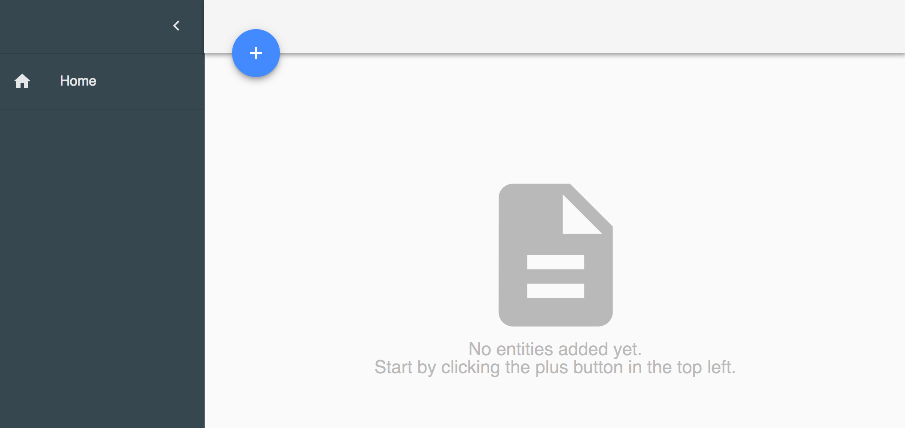

# go-entity-attribute-value
A small entity attribute value application using a Go REST server and react front end.

Entity-attribute-value tables allow the dynamic creation of new data structures without need for any table migrations. This application provides an API for creating entity metadata and data.
https://en.wikipedia.org/wiki/Entity%E2%80%93attribute%E2%80%93value_model
# Demo
**On the home screen we see an empty list of entities, so lets add one by hitting the plus button**


**We'll start by adding a 'Person' entity to keep track of contact information**


**We can now see a new navigation route to see and create records of type 'Person'**


**The fields entered when creating the 'Person' entity will now show up when creating a record of that type**


**After saving our Person, they'll show up in a list of 'Person' records**


# Setup
```bash
git clone git@github.com:nickapopolis/go-entity-attribute-value.git
cd go-entity-attribute-value.git
go install

cd public
nvm use
yarn
yarnpkg run start & go run ../*.go
```

# API
***/api/1.0***

Endpoint | Action | Description
--- | --- | ---
/entity | POST | Create a new Entity Type
/entity | GET | List all Entity Types
/entity/{id} | GET | Load Entity Type with id
/entity/{id} | POST | Update Entity Type with id
/eav/{entityId} | GET | List all data of a specific entity type
/eav/{entityId} | POST | Create entity of a specific type
